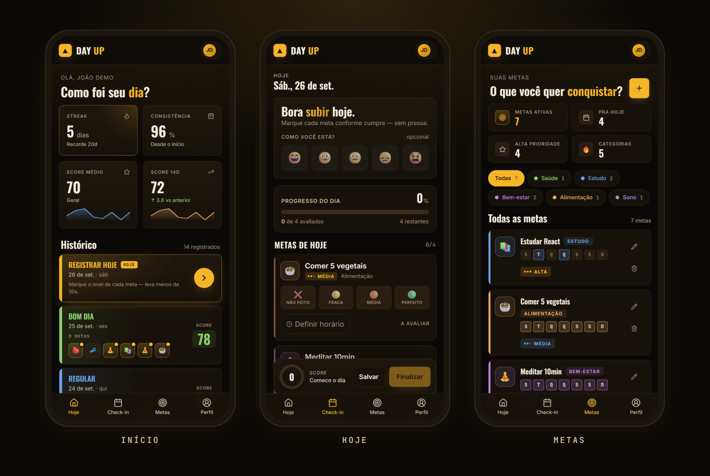
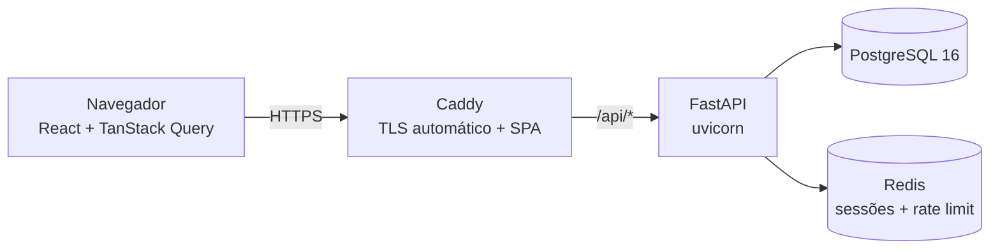

<div align="center">

# ▲ Day UP

**Sua rotina como um histórico de partidas.**
Metas com peso, check-in diário em poucos toques e um score de 0 a 100 para cada dia, num histórico denso no estilo OP.GG / DeepLoL.

[**🔗 dayup.biigstudio.com.br**](https://dayup.biigstudio.com.br) · conta demo: `demo@dayup.app` / `demo1234`

[](https://github.com/joaopedro-ssilva/DayUP/actions/workflows/ci.yml)




</div>

---

## O que é

A maioria dos apps de hábito é uma lista de checkbox que você larga em duas semanas. O Day UP trata cada dia como uma **partida**: você avalia o esforço em cada meta, o app calcula um placar ponderado e o dia entra num histórico que dá vontade de revisitar, como o histórico de partidas de um jogo.

1. **Metas recorrentes** por categoria (Saúde, Estudo, Bem-estar, Alimentação, Sono), cada uma com **peso** (1, 2 ou 3) e **dias da semana** em que vale.
2. **Check-in** na tela *Hoje*: para cada meta do dia, um toque em um de quatro níveis — não feito (0) · fraca (40%) · média (70%) · perfeita (100%). Mood, nota do dia e horário são opcionais.
3. **Score do dia**, em tempo real:

   ```
   score = round_half_up( Σ(peso × nível) / Σ(peso das metas do dia) × 100 )
   ```

   Metas ainda não avaliadas contam como zero. O resultado vira um tier: Perfeito (100) · Excelente (85+) · Bom (65+) · Regular (45+) · Difícil.
4. **Histórico e métricas**: streak (atual e recorde), consistência, score médio e tendência dos últimos 14 dias contra os 14 anteriores.

| Estado do dia | Score médio | Consistência | Streak |
|---|---|---|---|
| ✅ Registrado | conta | positivo | soma +1 |
| 🏖️ Day Off | não conta | neutro | mantém |
| ⚠️ Não registrado | não conta | negativo | quebra |

Um dia pode ser registrado até o fim do dia seguinte sem quebrar o streak, e continua editável depois disso.

## Funcionalidades

- Cadastro e login com sessão no servidor (cookie HttpOnly) e logout real
- Metas com peso, categoria, dias da semana e biblioteca de metas prontas
- Check-in progressivo: salvar ao longo do dia, finalizar e reabrir
- Histórico paginado com dias não registrados sinalizados
- Métricas: streak atual/recorde, consistência, score médio e tendência de 14 dias
- Perfil: alterar nome, e-mail e senha; **exportar meus dados** (JSON) e **excluir conta**
- Mobile-first: pensado primeiro para o navegador do celular (360–390px) e **instalável na tela inicial** (PWA)

**Em breve:** recuperação de senha e verificação de e-mail (dependem de um serviço de e-mail) e notificações de lembrete. Veja o [roadmap](#roadmap).

## Arquitetura



Tudo roda com `docker compose` numa VM ARM do Oracle Cloud (Always Free). Só o Caddy expõe portas; API, banco e Redis ficam na rede interna. Frontend e API são servidos pela **mesma origem**, então os cookies de sessão funcionam com `SameSite=Lax` e sem CORS em produção.

## Decisões técnicas

- **Sessão no servidor (Redis) em vez de JWT.** O cookie carrega só um ID opaco; logout, troca de senha e exclusão de conta invalidam a sessão de verdade, em todos os dispositivos. O custo é depender do Redis, que também serve para o rate limiting.
- **Regras de negócio em funções puras.** Score e estatísticas (streak, consistência, tendência) ficam em `backend/app/services/` e são testados sem banco. O score usa aritmética inteira com arredondamento *half up*, idêntica no frontend, para o número mostrado durante a edição ser exatamente o salvo.
- **Histórico imutável.** Cada avaliação guarda um *snapshot* do peso da meta; mudar o peso depois não reescreve dias passados.
- **Integridade no banco, não só na API.** Constraints de unicidade (um registro por dia por usuário), checks de faixa (peso 1–3, níveis válidos, score 0–100) e migrações versionadas com Alembic.
- **Deploy simples de propósito.** Uma VM com Compose + Caddy em vez de vários serviços gerenciados: sem cold start e custo zero, em troca de cuidar de backup e atualização do servidor.

## Segurança

- Senhas com **Argon2id** (rehash automático quando os parâmetros mudam)
- Cookies `HttpOnly` + `Secure` + `SameSite=Lax` e proteção **CSRF** (double-submit) em toda mutação
- Troca de senha revoga as outras sessões; exclusão de conta apaga todos os dados
- **Rate limiting** por IP, por e-mail (só tentativas com falha) e por usuário em escritas
- Autorização por dono em todos os recursos, validação de entrada com Pydantic e limite de tamanho de requisição
- Cabeçalhos de segurança (CSP, HSTS, `X-Frame-Options`, `nosniff`) e documentação da API desligada em produção
- Erros de validação nunca devolvem o que foi enviado (senhas não vazam em respostas 422)

Encontrou algo? Veja [SECURITY.md](SECURITY.md).

## Stack

| Camada | Tecnologias |
|---|---|
| Backend | Python 3.12, FastAPI, SQLAlchemy 2, Alembic, Pydantic v2, argon2-cffi |
| Dados | PostgreSQL 16, Redis 7 |
| Frontend | React 18, TypeScript, Vite, TanStack Query v5, React Router 6, Tailwind CSS, Lucide |
| Infra | Docker Compose, Caddy, Oracle Cloud, GitHub Actions |

## Rodando localmente

Pré-requisitos: Docker, Python 3.12+ e Node 24.

```bash
# 1. Postgres e Redis de desenvolvimento
docker compose up -d

# 2. Backend (http://localhost:8000 — docs em /docs)
cd backend
python -m venv .venv && source .venv/bin/activate   # Windows: .venv\Scripts\Activate.ps1
pip install -r requirements.txt -e ".[dev]"   # versões travadas + ferramentas de dev
cp .env.example .env
alembic upgrade head
uvicorn app.main:app --reload

# 3. Frontend (http://localhost:5173 — faz proxy de /api para o backend)
cd frontend
npm ci
npm run dev
```

Conta demo com 7 metas e ~30 dias de histórico: `python -m scripts.seed_demo` (na pasta `backend/`, com o venv ativo).

### Testes e qualidade

```bash
cd backend && ruff check . && pytest      # precisa do Postgres e Redis do passo 1
cd frontend && npm run build              # typecheck + build
```

O mesmo roda no CI a cada push. Os testes cobrem o cálculo do score, as regras de streak e consistência, autorização entre usuários e o fluxo real de autenticação (cookies, CSRF, revogação de sessão).

## Deploy

O passo a passo de produção (VM, DNS, HTTPS, backup diário e reset noturno da conta demo) está em [deploy/README.md](deploy/README.md). Com o DNS apontando para a VM, um script sobe tudo:

```bash
bash deploy/setup-vm.sh dayup.biigstudio.com.br
```

## Estrutura

```
backend/
  app/
    routes/       endpoints por domínio (auth, goals, day_logs)
    services/     regras puras: scoring, stats
    models.py     tabelas SQLAlchemy
    schemas.py    contratos Pydantic
    security.py   sessão, CSRF, hashing
  alembic/        migrações
  tests/
frontend/src/
  pages/          Landing, Home, Hoje (CheckIn), Metas, Perfil, Login, Cadastro
  components/     UI reutilizável
  hooks/          useDayEditor (estado do check-in)
  lib/            cliente da API, queries, regras de score e datas
deploy/           compose de produção, Caddyfile, setup e backup
docs/             slides da apresentação e imagens
```

## Roadmap

- [ ] Recuperação de senha e verificação de e-mail (serviço de e-mail transacional)
- [ ] Lembrete de check-in por notificação push (PWA)
- [ ] Estatísticas por meta e cruzamento mood × score
- [ ] Mapa de calor anual do histórico

## Sobre o projeto

O Day UP nasceu como projeto da disciplina **Projeto de Desenvolvimento I** (SENAC, 2026). Os [slides da apresentação](docs/presentation/) contam a visão original do produto.

O histórico de commits começa curto por dois motivos: durante o semestre o código era versionado em blocos grandes, e parte do histórico se perdeu na migração entre GitHub e o GitLab exigido pela faculdade. Desde a publicação, o desenvolvimento segue com commits pequenos e focados, revisados pelo CI.
